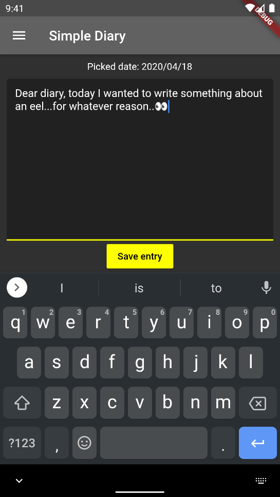
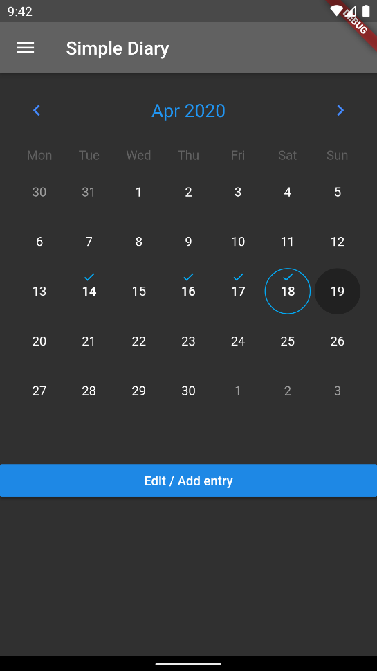

# Simple diary  

A new Flutter project, to learn about app development.  
Nothing special, just wondered myself how flutter worked and wanted to try it 😊  

## Screenshots

## What is this  

This is just a simple diary app (or at least that is what I was aiming for)    
The code is messy because I just hacked it together, without looking into the docs as much. So don't blame me (please...)  

## Why a diary?  
no reason, really. I just needed a sample project 👀

# Setup

My current setup is the exact same as described on the Flutter docs with VSCode.  
If you want to look into this project, you need to set it up [like this](https://flutter.dev/docs/get-started/install).   
and then clone this repo with `git clone https://github.com/getraid/simple_diary.git`.  
Open the `simple_diary` folder in VSCode or in any other editor and run the debugger, which should start your previously made Android VM with the app running.